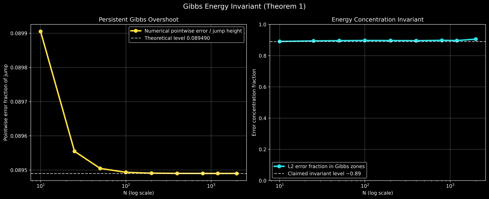
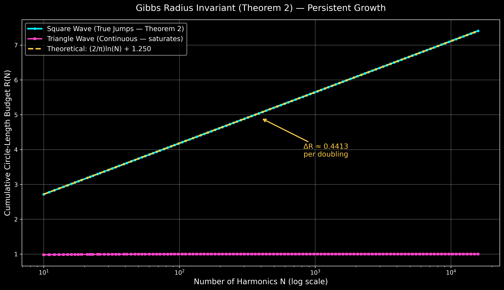

# The Gibbs Invariant

> Two computable invariants for Fourier approximations of discontinuous signals: an energy-concentration law and a radius-budget law.

---

## What This Is

This repository presents two linked theorems for piecewise-smooth periodic signals with jump discontinuities.

In short:

**Theorem 1 — Gibbs Energy Invariant:** For Fourier truncation order `N`, an `N`-stable fraction `C(α)` of remaining L² error concentrates in shrinking neighborhoods around discontinuities (zone width `α·π/K(N)`, with `K(N)=2N+1` for odd-harmonic truncation and `K(N)=N` for full-harmonic truncation). For the unit square wave at `α=1`, this is approximately `0.89`. A computable crossover `N₁` marks where pointwise Gibbs error (as a fraction of jump height) exceeds global RMS error.

**Theorem 2 — Gibbs Radius Invariant:** In epicycle/Fourier-coefficient form, signals with true jumps require a cumulative radius budget that grows as `R(N) ~ (2/pi) ln(N) + C`. Under doubling, the increment converges to the closed-form constant `ΔR -> (2/pi) ln(2) ≈ 0.4413`. Continuous controls (for example triangle wave) have saturating budget and vanishing doubling increment.

---

## Practical Implications

These invariants provide two quantitative diagnostics for deciding when global spectral refinement stops being efficient and discontinuity-aware treatment is warranted.

Common engineering heuristics can be interpreted through this lens:

| Domain | The Heuristic Workaround |
|---|---|
| MRI reconstruction | Apodization (global windowing) |
| Audio codecs | Short transform windows near transients |
| Image compression | Perceptual quality metrics over PSNR |
| Computational fluid dynamics | Artificial viscosity near shocks |
| Machine learning | Perceptual loss functions (VGG, SSIM) |
| Control systems | Event-triggered and feedforward control |

These examples motivate the same operational rule: once invariant behavior is detected, prioritize edge-localized correction over uniform global refinement.

---

## The Core Results at a Glance

### Energy Invariant
For a piecewise-smooth signal with jump discontinuities, truncated to N Fourier terms:

- **A stable fraction `C(α)` of total squared error** concentrates inside zones of width **`α·π/K(N)`** around each discontinuity
- For square-wave odd-harmonic truncation (`K(N)=2N+1`) at `α=1`, this concentration is **~0.89**
- The concentration is **stable in `N` for fixed `α`**, and **changes with `α`**
- Error density inside the zone scales as **O(N)**, compensating zone shrinkage
- The crossover **N₁ ≈ 26** (unit square wave) marks the point at which pointwise Gibbs error (as a fraction of jump height) surpasses global RMS error — after which global refinement is structurally inefficient

### Radius Invariant
For the same signal in epicycle form, the cumulative radius budget R(N) = Σ|cₖ|:

- Grows **logarithmically without bound**: R(M) ~ (2/π)ln(M) + C
- Per doubling: **ΔR → (2/π)ln(2) ≈ 0.4413** — exact, closed-form, invariant
- Smooth signals (triangle wave, etc.) converge to finite budget; increments decay to zero
- Decision rule: if the per-doubling increment stays **above ~0.2** past N ≈ 50, the signal contains true jump discontinuities

Mechanism (both theorems): near jumps, missing harmonics align constructively; away from jumps, phases decorrelate and partially cancel.

---

## Numerical Plots (From `gibbs_invariant.py`)

### Theorem 1: Energy Invariant



Interpretation:

- Left panel: pointwise Gibbs error / jump height converges to the Wilbraham-Gibbs limit (~0.08949)
- Right panel: L² error concentration in Gibbs zones remains near the `α=1` level (~0.89 for square wave)

Code snippet used to compute the Theorem 1 metrics:

```python
def gibbs_overshoot(N: int,
                    amplitude: float = 1.0,
                    local_samples_per_harmonic: int = 64) -> float:
    m = max(4096, local_samples_per_harmonic * N)
    window = 6.0 * np.pi / max(N, 1)
    x_local = np.linspace(-window, window, m, endpoint=False)
    approx_local = square_wave_partial_sum(x_local, N=N, amplitude=amplitude)
    mask = np.abs(x_local) < 4 * np.pi / max(N, 1)
    return float(np.max(approx_local[mask]) if np.any(mask) else 0.0)

def energy_concentration_fraction(N: int,
                                  x: np.ndarray,
                                  amplitude: float = 1.0,
                                  zone_width_factor: float = ENERGY_ZONE_WIDTH_FACTOR) -> float:
    return energy_concentration_fraction_for_signal(
        N=N,
        x=x,
        target_fn=lambda z: square_wave(z, amplitude=amplitude),
        partial_sum_fn=lambda z, n: square_wave_partial_sum(z, N=n, amplitude=amplitude),
        jump_locations=(0.0, np.pi, -np.pi),
        zone_width_factor=zone_width_factor,
        harmonic_bandwidth="odd",
    )
```

### Theorem 2: Radius Invariant



Interpretation:

- Square-wave radius budget follows logarithmic growth: `R(N) ~ (2/pi) ln(N) + C`
- Doubling increment approaches `(2/pi) ln(2) ~ 0.4413`
- Triangle-wave control converges (no persistent budget growth)
- Additional discontinuous control (sawtooth) also shows logarithmic radius growth and persistent nonzero doubling increment

Code snippet used for the Theorem 2 budget:

```python
def square_wave_radii(N: int, amplitude: float = 1.0) -> np.ndarray:
    k = np.arange(1, 2 * N, 2, dtype=float)
    return (4 * amplitude) / (np.pi * k)

def cumulative_radius_budget(radii: np.ndarray) -> np.ndarray:
    return np.cumsum(radii)

def radius_doubling_deltas(radii: np.ndarray, min_n: int = 8) -> List[float]:
    deltas: List[float] = []
    n = max(min_n, 1)
    while 2 * n <= len(radii):
        delta = radii[:2 * n].sum() - radii[:n].sum()
        deltas.append(delta)
        n *= 2
    return deltas
```

Run locally to regenerate both figures:

```bash
python3 gibbs_invariant.py
```

---

## Reproducibility

Environment:

- Python `3.9+`
- `numpy`, `matplotlib`

Run:

```bash
python3 gibbs_invariant.py
```

Expected verification markers in console output:

- `Theorem 2 delta-per-doubling target: 0.441271200305`
- `Theorem 1 overshoot target (plateau=1): 1.178979744472`
- `Theorem 1 pointwise error as jump fraction: 0.089489872236`
- `Estimated crossover N where pointwise Gibbs error > global RMS error: 26`
- `Additional discontinuous example (sawtooth):`
- `Zone-width robustness check (square wave):`

The exact table values may vary at the last displayed digit by platform/BLAS implementation, but the constants and crossover should remain stable.

---

## Repository Contents

| Document | Description |
|---|---|
| [Repository Overview](README.md) | Top-level overview of the two Gibbs invariants, why they matter, and how to navigate the repository. |
| [Theorem 1: Energy Concentration Invariant](docs/theorem_1_energy_invariant.md) | Theorem 1 statement and implications for energy concentration of Fourier truncation error near discontinuities. |
| [Theorem 1 Technical Exposition](docs/theorem_1_technical_exposition.md) | Full technical derivation and analysis of Theorem 1, including mechanism and falsification criteria. |
| [Theorem 2: Radius Budget Invariant](docs/theorem_2_radius_invariant.md) | Theorem 2 statement and decision rule based on persistent per-doubling radius budget growth. |
| [Theorem 2 Technical Exposition](docs/theorem_2_technical_exposition.md) | Full technical derivation and asymptotics for the radius-budget invariant in epicycle/Fourier form. |
| [Industry Applications Whitepaper](docs/industry/industry_applications.md) | Industry-focused whitepaper on practical use of the persistent circle-length budget across engineering domains. |
| [Theorem Applicability Comparison](docs/industry/theorem_applicability_comparison.md) | Comparison of when to use Theorem 1 versus Theorem 2 for analysis and system design decisions. |
| [Theorem Role Summary](docs/industry/theorem_role_summary.md) | Short role summary: Theorem 2 for edge detection/regime switching, Theorem 1 for resolution/error budgeting. |
| [GitHub Candidate Software List](docs/industry/github_candidate_software_list.md) | Curated list of GitHub software candidates for implementing and testing invariant-driven ideas. |
| [Industrial Implications Report (DOCX)](docs/industry/gibbs_industrial_implications.docx) | Editable DOCX version of the industrial implications report. |
| [Industrial Implications Report (Markdown)](docs/industry/gibbs_industrial_implications.docx.md) | Markdown-exported version of the industrial implications report for review and version control. |
| [Industrial Implications Report (PDF)](docs/industry/gibbs_industrial_implications.docx.pdf) | PDF export of the industrial implications report for distribution and presentation. |

---

## Falsifiability

Each theorem includes explicit falsification criteria in the technical expositions.

The Gibbs Energy Invariant is falsified if, for a sharp square wave and fixed `α`, the fraction of squared error inside the `α·π/(2N+1)` zone around each discontinuity decays steadily with `N` rather than stabilizing near `C(α)`.

The Gibbs Radius Invariant is falsified if, for a sharp square wave, the added total radius per doubling decays steadily rather than settling near (2/π)ln(2) ≈ 0.4413.

Both have been verified numerically across `N = 10` through `N = 2,000` with convergence to theoretical values.

---

## Status

The theoretical results are established for the canonical piecewise-smooth case (square wave and relatives). Active work covers:

- [ ] Generalization of N₁ to the full piecewise-smooth function class  
- [ ] 2D extension (edges replacing point discontinuities)  
- [ ] Noise robustness analysis and modified detection thresholds  
- [ ] Non-uniform sampling analog  
- [ ] Formal submission

---

## Citation

If you use these results, please cite this repository until a formal paper is available.

```
@misc{gibbs-invariant,
  title   = {The Gibbs Invariant: Energy Concentration and Radius Budget Theorems
             for Fourier Representations of Piecewise-Smooth Signals},
  year    = {2026},
  url     = {https://github.com/zfifteen/gibbs-invariant}
}
```

---

*The Gibbs phenomenon can be used as a measurable diagnostic, not only as a limitation: it quantifies where and how spectral representations fail near discontinuities.*
