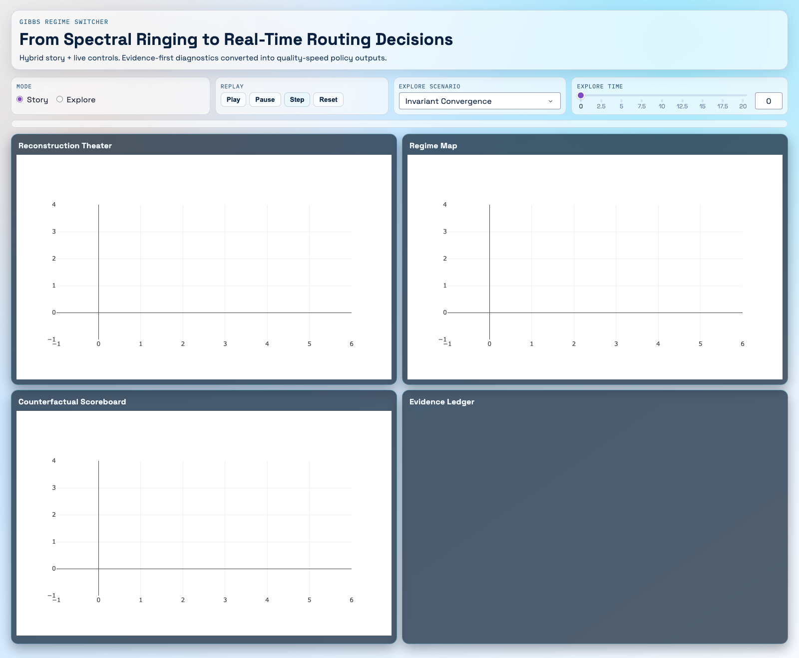
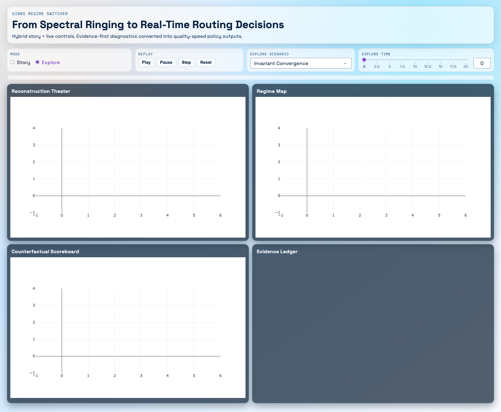
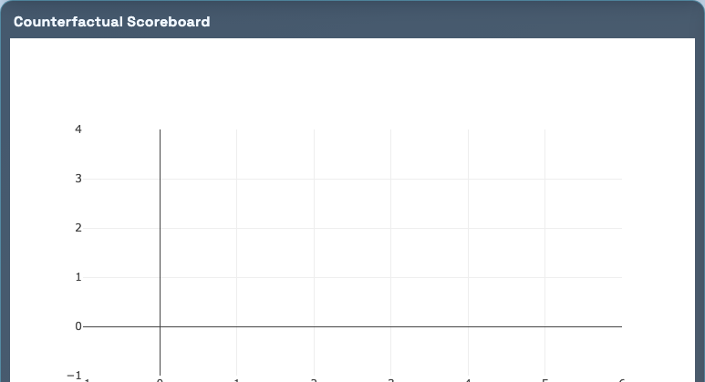
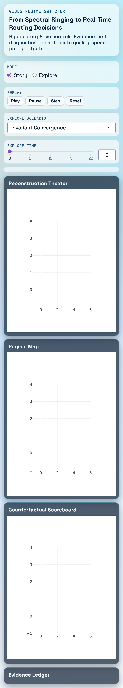

# Gibbs Regime Switcher User Guide

This guide covers setup, launch, controls, interpretation, and common workflows for the interactive demo.

## 1. What You Are Running

The demo is an interactive Dash application that turns Gibbs-invariant diagnostics into live routing decisions.

Core modes:

- **Story**: guided autoplay through six scenes.
- **Explore**: manual control over scenario and time.

Core panels:

- **Reconstruction Theater**
- **Regime Map**
- **Counterfactual Scoreboard**
- **Evidence Ledger**

---

## 2. Prerequisites

From the repository root:

```bash
cd /Users/velocityworks/IdeaProjects/gibbs-invariant
```

Expected environment:

- Python virtualenv at `.venv`
- Demo dependencies installed (`numpy`, `matplotlib`, `dash`, `plotly`)

If needed:

```bash
.venv/bin/python3.14 -m pip install numpy matplotlib dash plotly
```

---

## 3. Fastest Start (One Click)

Use the launcher script:

```bash
./scripts/run_demo.sh
```

What it does:

1. Refreshes artifacts with `experiments/run_all.py`
2. Starts the app at `http://127.0.0.1:8050`

Useful options:

```bash
./scripts/run_demo.sh --skip-pipeline
./scripts/run_demo.sh --no-launch
./scripts/run_demo.sh --help
```

---

## 4. First Look: Story Mode

When the app opens, Story mode is active and begins autoplay.


### Story controls

- `Play`: resume autoplay
- `Pause`: freeze current scene
- `Step`: advance exactly one scene
- `Reset`: restart from scene 1

### Scene order

1. Invariant Convergence
2. N1 Crossover
3. Noise/Jitter Stress
4. Closure-Matched Smooth Control
5. Codec Routing Economics
6. Deployment Bridge (mozjpeg)

Example later scene:



---

## 5. Explore Mode (Manual Analysis)

Switch to **Explore** when you want controlled inspection instead of autoplay.

What you can change:

- **Scenario** dropdown
- **Explore Time** slider



Recommended workflow:

1. Pause Story mode.
2. Switch to Explore.
3. Pick a scenario (`noisy_discontinuity`, `bandlimited_edge`, `step_function`, etc.).
4. Move time to inspect metric stability and routing behavior.

`bandlimited_edge` is the closure-matched smooth control. It is useful as the "no hidden seam" comparison against the discontinuous scenarios.

---

## 6. Reading Each Panel

## Reconstruction Theater

Shows observed signal, smooth path, expensive path, and detected edge routing zones.

Use it to answer:

- Where is the model classifying difficult edge regions?
- How much extra complexity is concentrated near discontinuities?

## Regime Map

Shows jump score and energy redistribution versus harmonic budget, with a closure-ratio annotation for the current signal.

Use it to answer:

- Is jump behavior consistently above threshold?
- How stable is energy concentration as N changes?
- Does the periodic wrap-around close cleanly, or is there a boundary seam the FFT will treat as a jump?

## Counterfactual Scoreboard

Compares baseline vs routed policy on edge MSE, smooth MSE, and compute cost.

Primary outputs:

- `quality_gain = baseline_edge_mse - routed_edge_mse`
- `smooth_penalty = routed_smooth_mse - baseline_smooth_mse`
- `speed_gain = 1 - routed_cost / baseline_cost`



Interpretation:

- Higher positive `quality_gain` is better.
- `smooth_penalty` near zero or negative is preferred.
- Positive `speed_gain` indicates compute reduction.

## Evidence Ledger

Displays artifact validity and gate status from:

- `results/pipeline_summary.json`
- `results/gates_report.json`
- `results/constrained_metrics.json`
- `results/candidate_rankings.csv`

It separates:

- **Validated**: claims directly backed by current artifacts
- **Roadmap**: next-step integration ideas (not claimed as measured)


---

## 7. Mobile Experience

The layout automatically stacks for smaller screens.



On mobile:

- Controls appear vertically
- Panels stack one per row
- All key metrics remain readable

---

## 8. Replay Mode (Deterministic, Non-UI)

For scripted reproducibility:

```bash
.venv/bin/python3.14 -m demo.replay --scenario noisy_discontinuity
```

Optional save:

```bash
.venv/bin/python3.14 -m demo.replay --scenario step_function --output work/replay_step_function.json
```

Replay output includes:

- scenario metadata
- timeline samples
- deterministic `timeline_hash`

---

## 9. Typical Session Recipe (5 minutes)

1. Launch: `./scripts/run_demo.sh`
2. Watch one full Story cycle.
3. Pause and Step through scenes 3, 4, and 5.
4. Switch to Explore and compare `bandlimited_edge` (closure-matched smooth control) vs `noisy_discontinuity`.
5. Check that Evidence Ledger is green for current artifacts.
6. Use replay command for a deterministic record.

---

## 10. Troubleshooting

### App does not start

- Verify venv python exists:
  - `/Users/velocityworks/IdeaProjects/gibbs-invariant/.venv/bin/python3.14`
- Reinstall dependencies:
  - `.venv/bin/python3.14 -m pip install numpy matplotlib dash plotly`

### Evidence panel shows artifact error

Regenerate pipeline outputs:

```bash
.venv/bin/python3.14 experiments/run_all.py
```

### Port conflict on `8050`

Stop the existing process using that port, then relaunch.

---

## 11. Files Referenced by This Guide

- App entry: `demo/app.py`
- Engine: `demo/engine.py`
- Replay CLI: `demo/replay.py`
- Scenarios: `demo/scenarios/*.json`
- Launcher: `scripts/run_demo.sh`
- Screenshots: `docs/assets/demo_user_guide/*.png`
